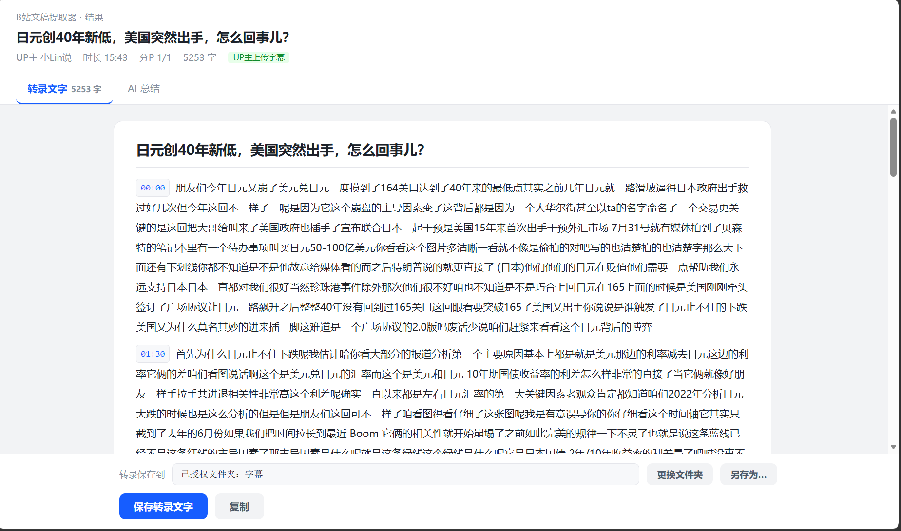
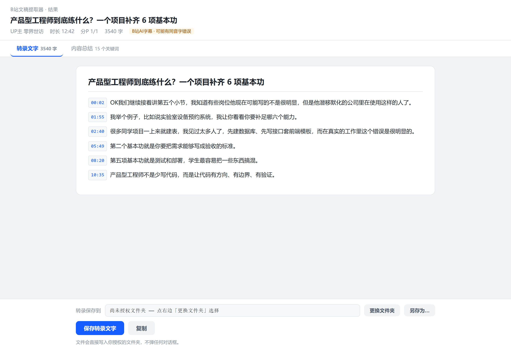
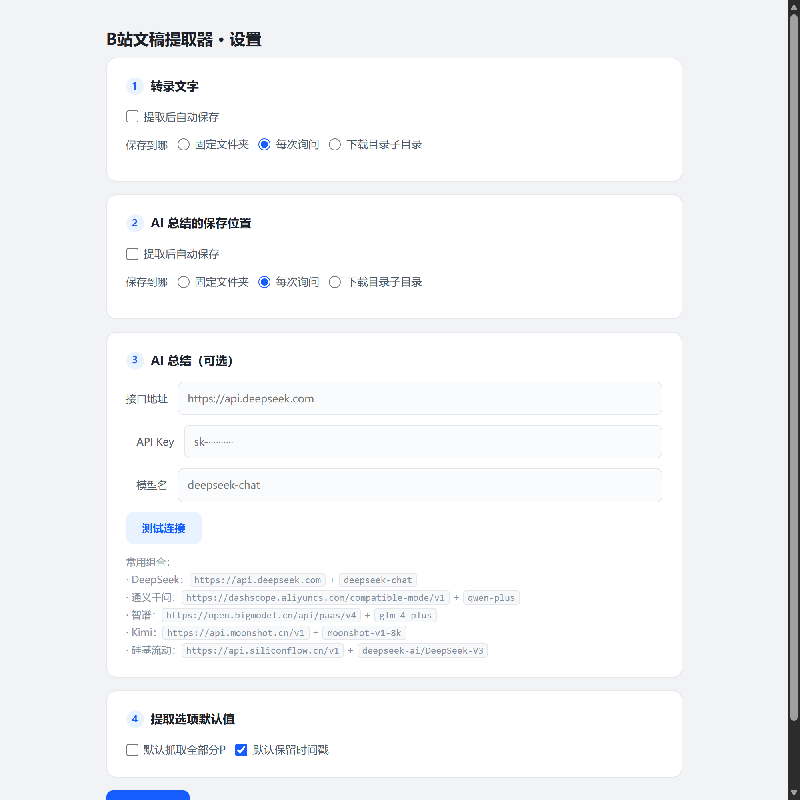

# 视频文稿提取器

浏览器扩展：一键把 **B站 / YouTube** 视频字幕提取成可读文稿，可选接入大模型生成结构化内容总结。

## 功能

- **转录文字** —— 提取字幕原文并自动补标点、分段（保留原文用词），带时间锚点
- **AI 总结** —— 把字幕交给大模型，按内容逻辑重组成分节总结（需自行配置接口）
- **中文字幕** —— YouTube 任意字幕轨道可机翻为中文；B站原生支持 AI 字幕 / CC
- **灵活保存** —— 固定文件夹 / 每次询问 / 浏览器下载目录子目录，三种方式独立配置
- **多语言字幕** —— YouTube 支持多语言字幕轨道（人工字幕优先）

## 安装

1. 下载本仓库（Code → Download ZIP，解压）
2. 打开 Edge / Chrome 的扩展管理页（`edge://extensions` 或 `chrome://extensions`）
3. 打开右上角「开发人员模式」
4. 点「加载解压缩的扩展」，选择本仓库的 `extension` 文件夹

## 使用

打开 B站或 YouTube 的视频页，点扩展图标：

- **只提取转录文字** —— 快速拿字幕原文（自动补标点分段）
- **提取并生成 AI 总结** —— 提取后调用大模型生成总结

### YouTube 中文

英文视频勾选「翻译成中文」，扩展会通过 YouTube 的字幕翻译接口生成中文版本。
对部分视频，YouTube 要求字幕必须先在播放器里加载一次 —— 提取失败时按提示
点开播放器的 CC 字幕开关，再点一次提取即可。

## 截图

| 转录文字（B站） | 设置 |
|---|---|
|  |  |

## 手机上使用（Edge for Android）

Edge for Android 支持扩展，但**只能按 crx 文件安装**（移动端不支持加载解压文件夹）：

1. 从本仓库的 [Releases](../../releases) 下载 `.crx` 文件
2. 手机 Edge → `···` → 设置 → **关于 Microsoft Edge** → 连续点 5 次版本号
3. 返回设置页，底部出现「**开发人员选项**」→ 点「**Extension install by crx**」→ 选择该文件

**移动端限制**：Android 浏览器没有 File System Access API，所以「固定文件夹」模式不可用
（扩展会自动禁用它）。请改用「每次询问」或「下载目录子目录」。
另外扩展的配置与文稿存在**各设备本地**，手机与电脑互不同步，需分别配置。

## AI 总结配置

设置页 →「AI 总结」，填入任意 OpenAI 兼容接口（三样：接口地址 / API Key / 模型名）：

| 服务 | 接口地址 | 模型名 |
|---|---|---|
| DeepSeek | `https://api.deepseek.com` | `deepseek-chat` |
| 通义千问 | `https://dashscope.aliyuncs.com/compatible-mode/v1` | `qwen-plus` |
| 智谱 | `https://open.bigmodel.cn/api/paas/v4` | `glm-4-plus` |
| Kimi | `https://api.moonshot.cn/v1` | `moonshot-v1-8k` |
| 硅基流动 | `https://api.siliconflow.cn/v1` | `deepseek-ai/DeepSeek-V3` |

不配置也不影响字幕提取 —— 提取和整理全部本地完成，**不联网上传任何内容**。

## 隐私

- 字幕提取与整理全部在本地完成，不经任何第三方服务器
- AI 总结仅在你主动点击时，把字幕文本发送给你自己配置的模型接口
- 扩展不收集、不上传任何使用数据

## 免责声明

本项目仅供学习与研究。使用时请遵守 B站、YouTube 的服务条款及相关法律法规，
字幕内容的版权归原作者所有，请勿用于商业用途。

## License

[MIT](LICENSE)
